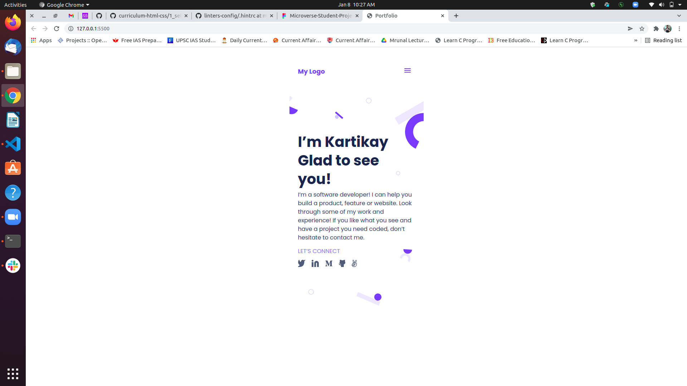

# My-Portfolio

> Setup and mobile version skeleton

## Built With

- HTML/CSS
- LINTERS
- VSCODE

## Getting Started

To get a local copy up and running follow these simple example steps.

### Prerequisites

- GITHUB
- IDE

### Setup

- git clone https://github.com/thenarain/Portfolio.git

## Authors

👤 **Kartikay Srivastava**

- GitHub: [@thenarain](https://github.com/thenarain)
- Twitter: [@TheNarainKartik](https://twitter.com/TheNarainKartik)
- LinkedIn: [@kartikay-srivastava](https://www.linkedin.com/in/kartikay-srivastava/)

## Acknowledgments

- Hat tip to anyone whose code was used
- Inspiration
- etc

## 📝 License

This project is [MIT](./MIT.md) licensed.
